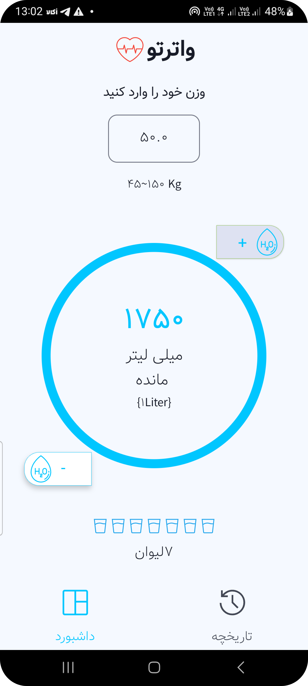
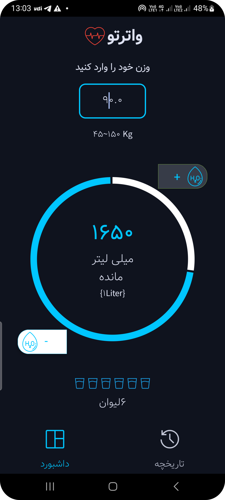

# 💧 وارترتو (WaterTo)

یک اپلیکیشن ساده و کاربردی برای مدیریت و رهگیری مصرف روزانه آب. با وارترتو، رسیدن به هدف روزانه آبرسانی تبدیل به یک عادت لذت‌بخش می‌شود.

---

## 📸 نمایشی از اپلیکیشن

### صفحه اصلی و رهگیری مصرف

  
    

---

## ✨ امکانات کلیدی

*   **⏰ یادآور هوشمند:** اعلان‌های ملایم برای یادآوری نوشیدن آب در طول روز.
*   **📊 داشبورد پیشرفت:** مشاهده آمار لحظه‌ای و درصد پیشرفت نسبت به هدف روزانه.
*   **📅 تاریخچه کامل:** مرور آمار مصرف روزانه، هفتگی و ماهانه در قالب نمودارهای گرافیکی.
*   **⚙️ تنظیمات شخصی:** تعیین هدف مصرف روزانه بر اساس وزن و سطح فعالیت شما.
*   **🎨 رابط کاربری شهودی:** طراحی مدرن و تجربه کاربری ساده و لذت‌بخش.

---

## 🚀 نحوه استفاده

1.  **هدف روزانه خود را تنظیم کنید.** (پیش‌فرض بر اساس وزن شما پیشنهاد می‌شود)
2.  **با هر بار نوشیدن آب، مقدار مصرف را به اپ اضافه کنید.**
3.  **پیشرفت خود را در صفحه اصلی دنبال کنید.**
4.  **از اعلان‌های برنامه برای فراموش نکردن نوشیدن آب استفاده نمایید.**

---

## 📥 دانلود و نصب

میتوانید آخرین نسخه اپلیکیشن را از طریق لینک‌های زیر دریافت کنید:

---

## 🛠️ فناوری‌های مورد استفاده

*   **kotlin:** زبان برنامه‌نویسی.
*   **Hawk:** دیتابیس سبک و سریع برای ذخیره داده‌های محلی.
*   **Provider:** مدیریت حالت و وضعیت اپلیکیشن.
*   *   *jetpack compsoe.

---

## 🤝 مشارکت در توسعه

اگر علاقه‌مند به مشارکت در توسعه این پروژه هستید، خوشحال می‌شویم!
1.  Repository را Fork کنید.
2.  یک Branch برای feature خود ایجاد کنید (`git checkout -b feature/AmazingFeature`).
3.  تغییرات خود را Commit کنید (`git commit -m 'Add some AmazingFeature'`).
4.  تغییرات را به Branch خود Push کنید (`git push origin feature/AmazingFeature`).
5.  یک Pull Request باز کنید.

---

## 📄 مجوز

این پروژه تحت مجوز MIT منتشر شده است. برای اطلاعات بیشتر فایل `LICENSE` را مطالعه کنید.

---

با 💧 نوش جان!

